import MerkleTree from '@/components/MerkleTree';

## 默克尔树是什么？

默克尔树（Merkle Tree）是一种数据结构，用于存储和验证一组数据块的完整性。它由一个根节点和多个中间节点组成，每个节点都包含一个哈希值。  
以太坊的状态数据存储MPT（Merkle Patricia Tree），就是基于默克尔树的，但是他和默克尔树的结构上有所不同，在先理解默克尔树的基础上，再理解MPT会更容易。

## 默克尔树的结构

一般情况下默克尔树是一个二叉树，Root储存的是整个树的根，只要用户可以提供一个有效Path，和自身的Node，就可以轻松的检测提供的数据是否在这个树中。

就如上面这个例子：
我们现在有数据1,2,3,4,5,6，我们通过Hash函数计算出每个数据的Hash值，然后构建出默克尔树。  
其中

- Hash 0-0 = hash(hash(1), hash(2))
- Hash 0-1 = hash(hash(3), hash(4))
- Hash 1 = hash(hash(5), hash(6))
- Top Hash = hash(Hash 0, Hash 1)

此时，假设我是数据4，在只有Root的情况下，你如何证明你数据4在这个树🌲上？

### 证明数据在树🌲上
证明数据在树上其实的步骤非常简单，我们需要两个数据，一个是Path，一个是Node。

- Path：从Root到Node的路径
- Node：需要证明的数据

在上面这个例子中，对应的数据就是

- Path: [ hash(3),Hash 0-0, Hash 1 ]
- Node: 4

根据我们目前有4这个数据，可以计算出hash(4),**然后和hash(3)组合进行hash，得到Hash 0-1**。  
然后和**Hash 0-0组合进行hash，得到Hash 0**。  
最后和**Hash 1组合进行hash，得到Root**。  

此时校验计算的Root是否和原本的Root一致，如果一致，则数据4在树🌲上。